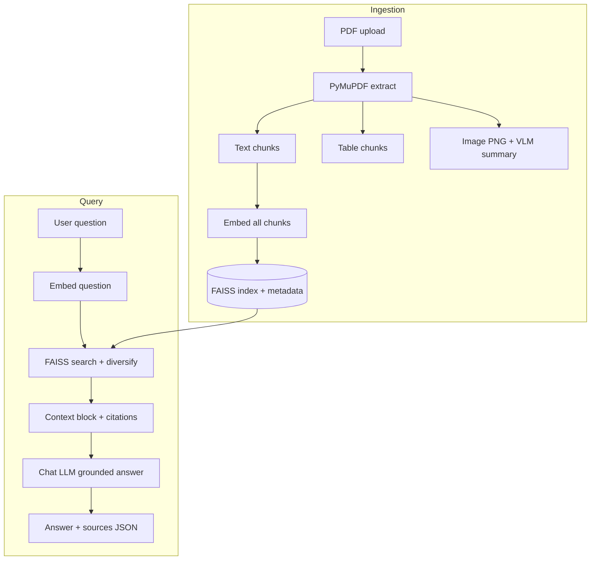
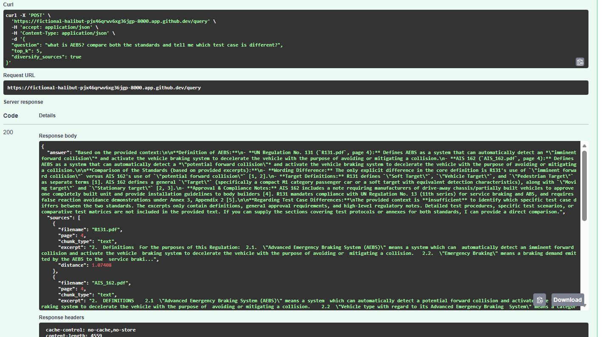
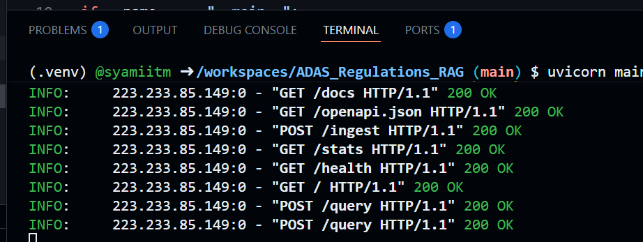
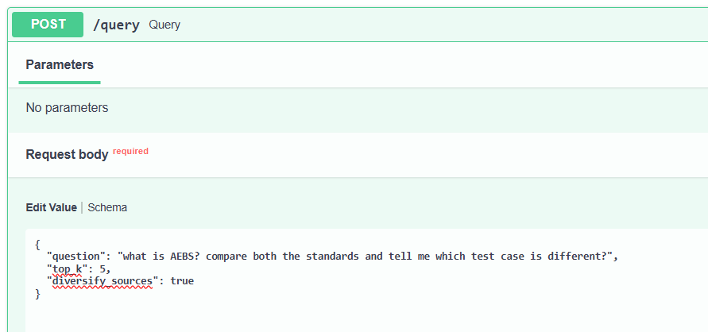
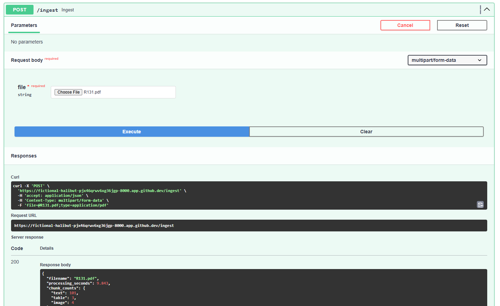
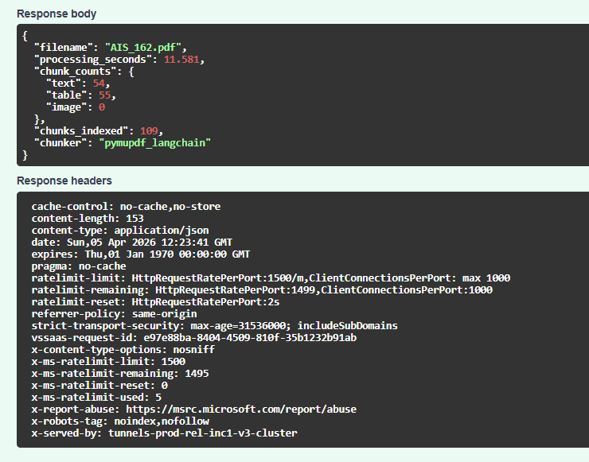
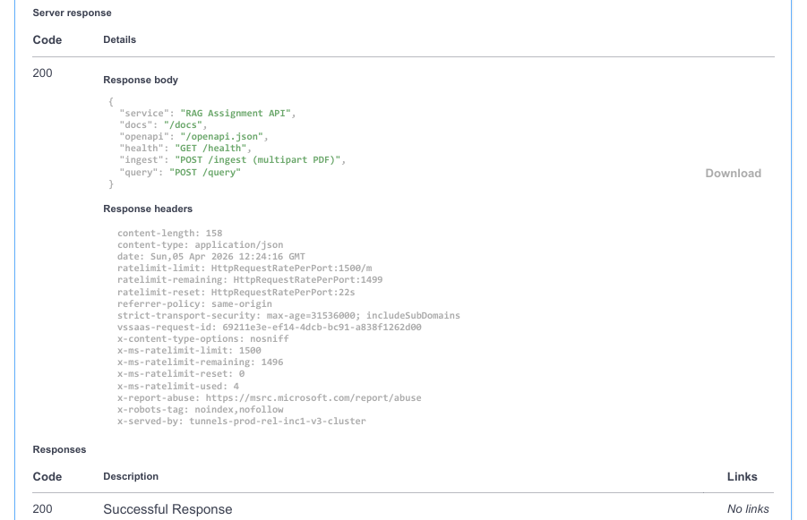
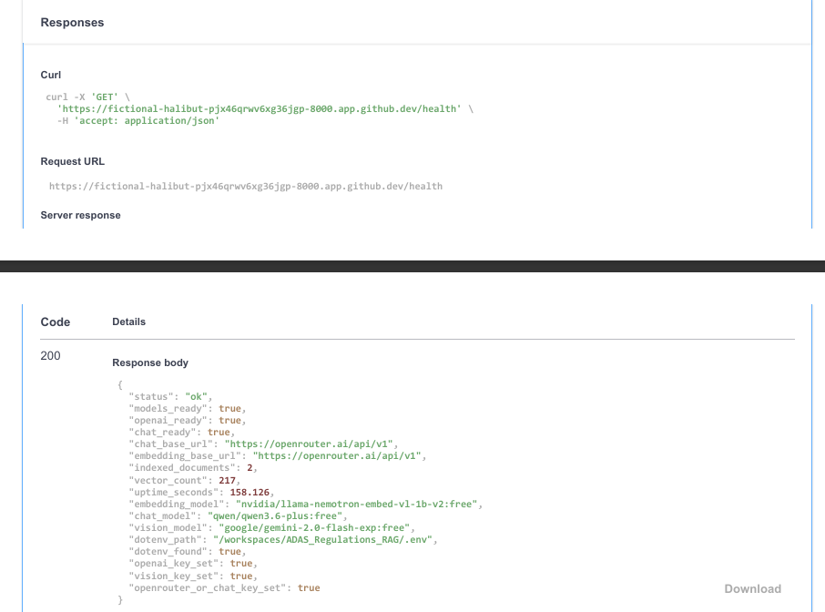
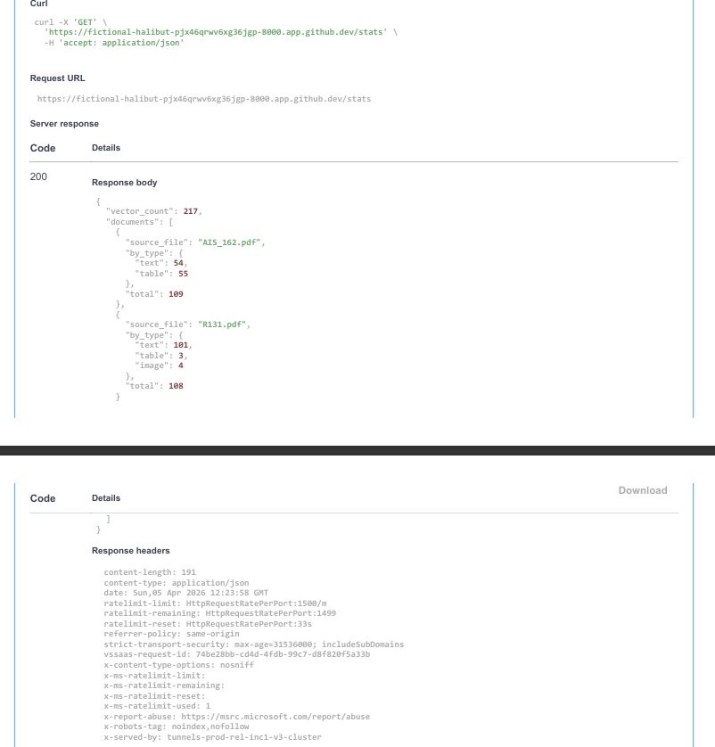

# Multimodal RAG API — ADAS regulatory intelligence (AIS‑162 & UNECE R131)

## Problem Overview

### Domain Identification
The system focuses on **vehicle type approval and ADAS regulatory engineering**, specifically for:
- **AIS-162 (India)** – AEBS requirements for commercial vehicles  
- **UNECE R131** – International AEBS regulation  

Users include homologation engineers, compliance teams, and test-house reviewers who work with **multimodal PDF documents** containing:
- Normative text clauses  
- Annex tables (speed limits, timing, exclusions)  
- Scenario diagrams  

Their tasks involve **conformity checks, homologation extensions, and compliance documentation**, all requiring strict alignment with regulatory wording.

---

### Problem Description
The key challenge is **accurately comparing regulations** without:
- Misinterpreting tabular data  
- Losing context from diagrams  

Regulatory information is inherently **multimodal**:
- Tables define limits  
- Text defines rules  
- Figures define scenarios  

Simple queries often require **combined interpretation** of all three.  
Traditional methods (keyword search, text extraction) fail due to:
- Loss of table structure  
- Separation of figures from context  
- Broken cross-references  

This leads to **manual comparison**, which is:
- Time-consuming  
- Error-prone  
- Difficult to audit  

---

### Why This Is Not Generic Q&A
This is a **domain-specific problem**, not general document querying. Queries require:
- Identifying **alignments and differences** across regulations  
- Maintaining **traceability** to exact clauses, tables, or figures  
- Understanding **specialised terminology** (vehicle categories, system states, etc.)  

Even small errors (e.g., wrong speed threshold) can result in **invalid compliance decisions**.  
Generic PDF chat systems lack the ability to provide **structured, evidence-backed answers**.

---

### Why RAG Is the Right Approach
A **Retrieval-Augmented Generation (RAG)** approach is suitable because:

- Avoids outdated knowledge from fine-tuning  
- Preserves **provenance** (exact source of information)  
- Combines **text, tables, and image summaries** during retrieval  

The system:
- Retrieves relevant multimodal chunks  
- Maintains metadata (file, page, type)  
- Generates answers constrained to retrieved evidence  

This ensures **auditable and reliable outputs**, critical for regulatory workflows.

---

### Expected Outcomes
The system is expected to:
- Enable **accurate comparison** of AIS-162 and R131  
- Provide **citation-backed, grounded answers**  
- Reduce **manual effort and errors**  
- Support **better compliance decision-making**  

It also handles **uncertainty explicitly**, avoiding unsupported conclusions when data is insufficient.


---

## Architecture overview

**Ingestion pipeline.** A PDF is opened with **PyMuPDF**. **Text** pages are split with **LangChain `RecursiveCharacterTextSplitter`** (structure-aware separators). **Tables** are detected with **`Page.find_tables()`**, exported as markdown or TSV-style text, and split if oversized. **Images** (deduplicated by PDF xref) are rasterised to **PNG**, optionally summarised by a **VLM**, then concatenated with a short placeholder for embedding. All chunks are embedded with the configured model and appended to an in-memory **FAISS** index with rich metadata (`source_file`, `page`, `chunk_type`, etc.).

**Query pipeline.** The user question is embedded (optionally after an LLM **query rewrite**). **FAISS** returns nearest neighbours; optional **per-document diversification** helps multi-PDF comparison when one document dominates similarity. Retrieved texts and metadata are assembled into a **custom context block**; the **chat LLM** answers with a **grounding prompt** that forbids inventing requirements beyond context. Responses include **structured source references** (filename, page, chunk type, excerpt, distance).



---

## Technology choices

| Layer | Choice | Rationale |
|--------|--------|-----------|
| **Document parser** | **PyMuPDF (`fitz`)** + **LangChain** splitters | Fast, deployable without heavy ML parser stacks; explicit **text / table / image** chunk types via `find_tables()` and image xrefs. Meets the brief’s “Docling or equivalent” requirement while staying reproducible on modest environments (e.g. GitHub Codespaces). |
| **Embeddings** | **OpenRouter** · default **`nvidia/llama-nemotron-embed-vl-1b-v2:free`** (2048-d) | Strong default for bootcamp-style setups; works with a single API key pattern. **OpenAI `text-embedding-*`** supported via `EMBEDDING_MODEL` when `OPENAI_API_KEY` is set. |
| **Vector store** | **FAISS** (`IndexFlatL2`) | No external service; deterministic; easy to reason about for coursework and demos. Metadata stored in parallel Python structures aligned with vector order. |
| **Chat LLM** | **OpenRouter** (e.g. Qwen) or **OpenAI** when `CHAT_BASE_URL` is unset | One client abstraction (`OpenAI` SDK); model IDs from `.env`. |
| **VLM (images)** | **OpenRouter** vision-capable model (default **`google/gemini-2.0-flash-exp:free`**) or **OpenAI** multimodal when not using OpenRouter | Brief requires **text summaries of figures before embedding**, not raw pixels only. Failures are logged; ingest can continue with placeholders if the VLM errors (`SKIP_VLM=true` disables vision calls entirely). |
| **API** | **FastAPI** + **Pydantic** schemas | Automatic **OpenAPI** at `/docs`; typed request/response models; appropriate HTTP status codes for misconfiguration and upstream errors. |

### core components — requirement vs this codebase

| # | Component | Assignment requirement | Implementation (files) |
|---|-----------|------------------------|-------------------------|
| 1 | **Document parsing — text** | PDF ingestion with extractable **text** as structured chunks. | **`src/ingestion/smart_chunker.py`** — `SmartChunker.process_pdf()` uses **`fitz`** page text + **`RecursiveCharacterTextSplitter`** (`langchain_text_splitters`); metadata `chunk_type="text"`. **`src/ingestion/chunks.py`** — `ParsedChunk`. |
| 2 | **Document parsing — tables** | **Tables** as separate chunk types (Docling or equivalent). | **`src/ingestion/smart_chunker.py`** — `_collect_table_documents()`, **`Page.find_tables()`**, `_table_to_text()` / `to_markdown` + `extract()` fallback; `_split_oversized()`; `chunk_type="table"`. |
| 3 | **Document parsing — images** | **Images** as separate chunk types. | **`src/ingestion/smart_chunker.py`** — `_collect_image_documents()`, **`page.get_images(full=True)`**, xref dedup, **`_xref_to_png()`**; `chunk_type="image"`, `image_bytes` in metadata → **`src/ingestion/smart_chunker.py`** `documents_to_parsed_chunks()` → **`ParsedChunk.image_bytes`**. |
| 4 | **Embeddings & vector store** | Embed **all chunk types** into a **vector store**. | **`src/models/embeddings.py`** — **`embed_texts()`**; **`src/config.py`** — `EMBEDDING_MODEL`, `EMBEDDING_DIMENSION`. **`src/retrieval/vector_store.py`** — **`FaissVectorStore`**, `add()`, `search()`. **`src/ingestion/pipeline.py`** — **`ingest_pdf_to_store()`** builds texts + metadatas, then `store.add`. |
| 5 | **Image handling (VLM)** | **VLM text summaries** before embedding (not raw images only). | **`src/models/vision.py`** — **`summarize_figure_png()`**. **`src/ingestion/pipeline.py`** — **`_enrich_images_with_vlm()`** (before `embed_texts`). **`src/config.py`** — **`get_vision_model()`**, **`get_skip_vlm()`**. Clients: **`src/models/openai_client.py`** — **`get_vision_client()`**. |
| 6 | **RAG chain** | Retrieve chunks + **grounded** answers; **custom prompts**. | **`src/retrieval/query.py`** — **`run_query()`**, **`_diversify_hits()`**. **`src/models/llm.py`** — **`build_context_block()`**, **`answer_with_context()`**, optional **`rewrite_query_for_retrieval()`**. |
| 7 | **FastAPI server** | **FastAPI** only; **§3.2** endpoints + working **`/docs`**. | **`main.py`** — loads `.env`, exports **`app`**. **`src/api/app.py`** — routes **`GET /`**, **`GET /health`**, **`GET /stats`**, **`POST /ingest`**, **`POST /query`**. **`src/api/schemas.py`** — Pydantic models. **`src/api/state.py`** — store + ingest lock + counters. |

### Key project files (quick reference)

| Path | Role |
|------|------|
| **`main.py`** | Loads **`.env`**, re-exports **`app`** and **`run`** from **`src.api.app`** for **`uvicorn main:app`**. |
| **`src/api/app.py`** | FastAPI application, HTTP handlers, error mapping. |
| **`src/api/schemas.py`** | **`HealthResponse`**, **`IngestResponse`**, **`QueryRequest`**, **`QueryResponse`**, etc. |
| **`src/api/state.py`** | Global **FAISS** store, document count, uptime, **`ingest_lock`**. |
| **`src/config.py`** | **`reload_dotenv()`**, models, **`QUERY_DIVERSIFY_SOURCES`**, **`SKIP_VLM`**. |
| **`src/ingestion/smart_chunker.py`** | **`SmartChunker`**, **`documents_to_parsed_chunks()`**. |
| **`src/ingestion/pipeline.py`** | **`ingest_pdf_to_store()`**, VLM enrichment hook. |
| **`src/retrieval/query.py`** | **`run_query()`**, diversification. |
| **`src/retrieval/vector_store.py`** | **`FaissVectorStore`**. |
| **`src/models/embeddings.py`** | **`embed_texts()`**. |
| **`src/models/llm.py`** | Grounded **answer** + optional **query rewrite**. |
| **`src/models/vision.py`** | **VLM** figure summarisation. |
| **`src/models/openai_client.py`** | Embedding / chat / vision **OpenAI** SDK clients. |
| **`.env.example`** | Environment template (no secrets). |
| **`requirements.txt`** | Python dependencies. |

---

## Repository layout

```
├── README.md                 # This file (WILP-required sections)
├── requirements.txt
├── .env.example
├── .gitignore
├── main.py                   # Entry: loads .env, exports `app` for uvicorn
├── sample_documents/
│   ├── .gitkeep
│   ├── ADAS_1.pdf
│   ├── AIS_162.pdf
│   └── R131.pdf
├── screenshots/
│   ├── .gitkeep
│   ├── Answer_to_Query.png
│   ├── health.png
│   ├── Index_Stats.png
│   ├── Ingest_1.pdf
│   ├── Ingest_2.pdf
│   ├── Ingest_pdf1.png
│   ├── Ingest_pdf2.png
│   ├── Query.png
│   ├── Query_1.png
│   ├── RAG Assignment  Query results.pdf
│   ├── Screenshot1.png
│   ├── Screenshot2.png
│   ├── Screenshot3.png
│   ├── Screenshot4.png
│   ├── Screenshot5.png
│   └── Server_Response.png
└── src/
    ├── config.py
    ├── ingestion/            # Chunking, pipeline, VLM hook
    ├── retrieval/            # FAISS store, query, diversification
    ├── models/               # Embeddings, LLM prompts, vision wrapper
    └── api/                  # FastAPI app, schemas, application state
```

---

## Setup instructions

### Prerequisites

- **Python 3.11+** recommended  
- API keys as needed: **OpenRouter** (`OPENROUTER_API_KEY`, optional `CHAT_BASE_URL`) and/or **OpenAI** (`OPENAI_API_KEY`) — see `.env.example`

### Steps

```bash
git clone <your-public-repo-url>
cd <repo-directory>

python -m venv .venv
# Windows:
.venv\Scripts\activate
# Linux / macOS:
# source .venv/bin/activate

pip install -r requirements.txt
cp .env.example .env    # or copy on Windows: copy .env.example .env
# Edit .env: set OPENROUTER_API_KEY and/or OPENAI_API_KEY, models as needed.
```

### Run the server

```bash
# From repo root (uses main:app)
uvicorn main:app --host 0.0.0.0 --port 8000 --reload
```

Open **Swagger UI:** [http://127.0.0.1:8000/docs](http://127.0.0.1:8000/docs)  
For **GitHub Codespaces**, use the forwarded URL shown in the Ports tab.

**Embedding dimension.** Default Nemotron setup uses **2048** dimensions. If you change `EMBEDDING_MODEL` / `EMBEDDING_DIMENSION`, **restart the app** and **re-ingest** all PDFs so FAISS matches the new vector size.

**PowerShell tip:** `curl` aliases to `Invoke-WebRequest`. Use **`curl.exe`** for Unix-style examples, or **`Invoke-RestMethod`**.

---

## API documentation

All routes are also described interactively at **`GET /docs`** (OpenAPI).

### `GET /`

Browser: redirects to **`/docs`**. API clients: JSON with links to main routes.

### `GET /health`

**Purpose:** Liveness, model readiness, index size, uptime, non-secret config hints.

**Example response (abridged):**

```json
{
  "status": "ok",
  "models_ready": true,
  "openai_ready": true,
  "chat_ready": true,
  "indexed_documents": 2,
  "vector_count": 217,
  "uptime_seconds": 1532.818,
  "embedding_model": "nvidia/llama-nemotron-embed-vl-1b-v2:free",
  "chat_model": "qwen/qwen3.6-plus:free",
  "vision_model": "google/gemini-2.0-flash-exp:free"
}
```

### `POST /ingest`

**Purpose:** Upload one **PDF**; parse text / tables / images; VLM on images (unless `SKIP_VLM=true`); embed; append to FAISS.

**Request:** `multipart/form-data` with field **`file`** (PDF).

**Example (bash):**

```bash
curl -X POST "http://127.0.0.1:8000/ingest" \
  -H "accept: application/json" \
  -F "file=@sample_documents/AIS_162.pdf;type=application/pdf"
```

**Example response:**

```json
{
  "filename": "AIS_162.pdf",
  "processing_seconds": 8.512,
  "chunk_counts": { "text": 54, "table": 55, "image": 0 },
  "chunks_indexed": 109,
  "chunker": "pymupdf_langchain"
}
```

*Table/image counts depend on PDF structure and detection heuristics.*

### `POST /query`

**Purpose:** Natural-language question; retrieve top‑k chunks; grounded answer + sources.

**Request body (JSON):**

```json
{
  "question": "What is AEBS and how is it tested?",
  "top_k": 8,
  "diversify_sources": true
}
```

- `top_k` optional (default from `QUERY_TOP_K_DEFAULT`).  
- `diversify_sources` optional: when `true` (default from env), retrieval tries to include **at least one chunk per PDF** when multiple documents are indexed.

**Example response (abridged):**

```json
{
  "answer": "Based on the provided context …",
  "sources": [
    {
      "filename": "AIS_162.pdf",
      "page": 4,
      "chunk_type": "text",
      "excerpt": "2. DEFINITIONS … Advanced Emergency Braking System (AEBS) …",
      "distance": 1.134331
    }
  ]
}
```

### `GET /stats` *(additional endpoint)*

Returns **per-document** chunk counts by `chunk_type` for auditing the index.

### `GET /docs`

Auto-generated **Swagger UI** (required by the assignment).

---

## Evidence: RAG behaviour and screenshot trail

This section ties **runtime behaviour** to the captures in **`screenshots/`** so reviewers can see that retrieval is **grounded**, **multimodal**, and **intentionally improved** beyond a minimal prototype.

### How we know RAG is working as intended

| Signal | What it proves |
|--------|----------------|
| **`POST /ingest` response** | `chunk_counts.text` / `.table` / `.image` and `chunks_indexed` show **structured multimodal chunking**; `chunker: "pymupdf_langchain"` confirms the **PyMuPDF + LangChain** path (not a text-only dump). |
| **`POST /query` → `sources[]`** | Each hit includes **`filename`**, **`page`**, **`chunk_type`**, **`excerpt`**, **`distance`**: the LLM is given **retrieved** spans, not the full PDF—classic **retrieve-then-generate** with **auditable citations**. |
| **Answers that admit gaps** | When retrieval is dominated by one PDF (e.g. only AIS‑162 in top‑k), the model can state **insufficient context** for a cross-standard comparison—expected **honest grounding** under the system prompt in `src/models/llm.py`. |
| **`GET /health`** | `vector_count` and **`indexed_documents`** rise after each successful ingest; `models_ready` reflects embedding + chat (+ vision unless `SKIP_VLM=true`). |

### Improvements made for better answers (retrieval + reliability)

These changes directly target **answer quality**, **multimodal coverage**, and **multi-document** questions:

1. **Multimodal ingestion** — **Text** (recursive split with standards-friendly separators), **tables** (`Page.find_tables()` → markdown / cell fallback), **images** (xref → PNG, **VLM summary** appended before embedding). Image chunks are **searchable text** after VLM, satisfying the brief’s “summarise before embed” rule.
2. **Embedding stack fixes** — OpenRouter-compatible **`encoding_format="float"`** and a consistent **`embed_texts`** path so vectors are valid for FAISS (avoids empty or mismatched embedding payloads).
3. **Vision model selection** — Default VLM uses a **vision-capable** OpenRouter model (e.g. **`google/gemini-2.0-flash-exp:free`**). **`openrouter/free`** is **not** used for image input (OpenRouter returns 404 for multimodal there). Legacy `VISION_MODEL=openrouter/free` is **remapped** in config.
4. **Resilient VLM on ingest** — If the VLM errors on one figure, ingest **continues**: placeholder text is embedded, `vlm_applied` / `vlm_error` in metadata record the skip—no full **`POST /ingest`** failure for a bad image call.
5. **Multi-PDF retrieval** — **`QUERY_DIVERSIFY_SOURCES`** (default **on**) and optional JSON field **`diversify_sources`** on **`POST /query`**: FAISS is queried with a **larger pool**, then chunks are chosen so **each `source_file` can appear at least once** before filling remaining slots—reduces “all hits from one PDF” when comparing **AIS_162** vs **R131**.
6. **Grounded generation** — `answer_with_context` builds a numbered context block with **`source_file` / `page` / `chunk_type`** per chunk and instructs the model to answer **only** from that context (`src/models/llm.py`).
7. **Optional query rewrite** — With **`QUERY_REWRITE=true`**, a short LLM step rewrites the user question for **embedding only**, which can help lexical mismatch on regulatory wording (retrieval only; no answer leakage).

Together, these show **deliberate engineering** for WILP criteria: **RAG accuracy** (grounding + citations), **robustness** (VLM/embedding edge cases), and **cross-modal** retrieval (text + table + image summaries).

### Screenshot files (`screenshots/`)

Use these **exact filenames** in **`screenshots/`** (six PNGs for WILP §4.3). Commit them so GitHub renders the embeds below.

| File | WILP §4.3 evidence |
|------|-------------------|
| **`screenshots/Screenshot1.png`** | Swagger UI — **`GET /docs`** listing **`/health`**, **`/ingest`**, **`/query`**, **`/stats`**, etc. |
| **`screenshots/Screenshot2.png`** | **`POST /ingest`** — JSON with **`chunk_counts`**, **`chunks_indexed`**, **`chunker`**. |
| **`screenshots/Screenshot3.png`** | **`POST /query`** — **`sources`** with **`"chunk_type": "text"`**. |
| **`screenshots/Screenshot4.png`** | **`POST /query`** — **`sources`** with **`"chunk_type": "table"`**. |
| **`screenshots/Screenshot5.png`** | **`GET /health`** — **`indexed_documents`**, **`vector_count`**, **`models_ready`**. |

## 📸 Project Screenshots

### Query Results




### Ingestion Process



### Server & Health



### Index Stats


---

## Limitations and future work

- **Table detection** depends on **vector PDF structure**; scanned tables or purely graphical layouts may appear only as text or be missed.  
- **Image chunks** skip tiny bitmaps (size thresholds) to reduce noise; some logos may be excluded.  
- **Duplicate information** can appear in both **text** and **table** chunks for the same annex content.  
- **In-memory FAISS** resets on process restart unless extended with **`save`/`load`** persistence (helpers exist on the store class).  
- **Diversification** improves multi-PDF recall but does not guarantee optimal ranking for every comparative question; higher **`top_k`** or **MMR-style reranking** could be added.  
- **Dependency pinning:** `requirements.txt` uses lower bounds suitable for development; for maximum reproducibility, generate a **lock file** (`pip freeze`) before submission if your course requires strictly pinned versions.


